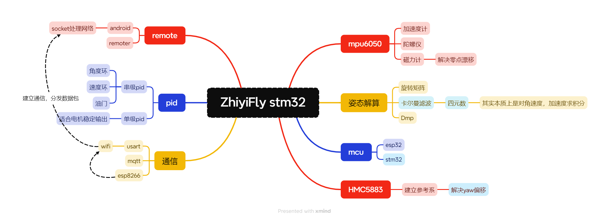
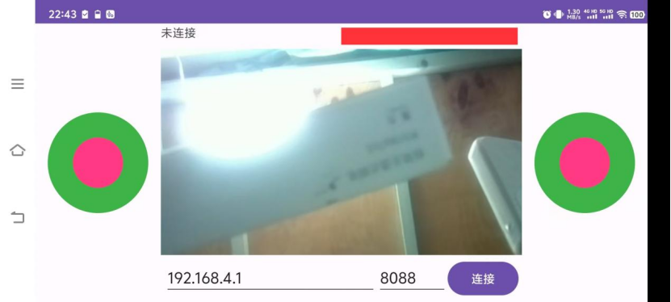
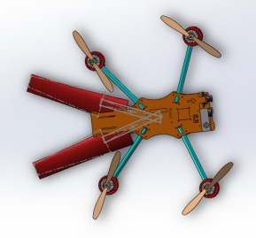
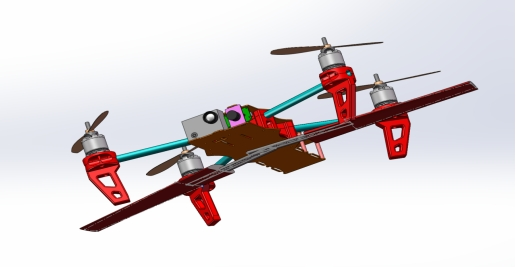
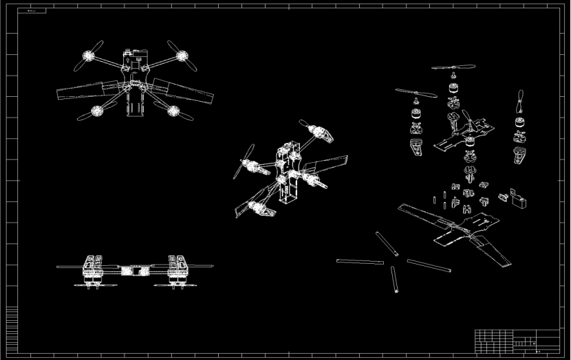

#  🥳[ ZhiyiFly v1.0](https://github.com/walkersYK/ZhiyiFly)

 本项目是一个关于可变形态无人机的设计，包含所有硬件代码以及安卓端控制代码

 
    
    

    

    
    

🚀 新型无人机

- ✅ 编译控制的便携设备
- ✅ 支持多旋翼与固定翼
- ✅支持移动设备进行控制

### ✨ Zeabur (一键部署)

​    

红外热成像直接发现可见光无法看到的火灾热点（右图发红的部分)

感谢以下项目：

## ❓ 常见问题 Q&A

⚡ Docker 安装 (轻量运行时, 常用于外置 _MYSQL/RDS_ 服务)

> 感谢以下项目：

如果您觉得这个项目对您有所帮助, 您可以点个 Star